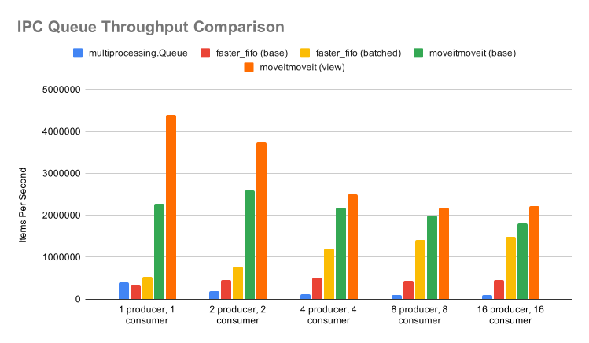

# 🦛 moveitmoveit
***High-performance Python inter-process work-stealing deque***

In multiprocessing applications, uneven task distribution results in starvation of fast workers. A *work-stealing* deque gives each process ownership over its own queue via `put`/`get` operations, but also allows processes to `steal` items from other processes' queues, allowing for *load-balancing under irregular data streams*. The implementation is largely based on [David Chase and Yossi Lev, 2005](https://dl.acm.org/doi/10.1145/1073970.1073974).

`moveitmoveit.Deque` achieves **throughput of 2.1 million items per second**, *11 times higher* than Python's `multiprocessing.Queue` and *double that of* [faster-fifo.Queue](https://github.com/alex-petrenko/faster-fifo)*.

## ⚙️ Features
- Extension of Python's `multiprocess.Queue` API
- Lock-free algorithms
- Zero-copy using shared memory
- Dynamic resizing
- Python type agnostic

## ⚡Performance


`moveitmoveit.Deque` has consistently higher throughput than Python's `multiprocessing.Queue` and [faster-fifo.Queue](https://github.com/alex-petrenko/faster-fifo)*.

All tests run on Ubuntu 26 VM (6 cores, 16 GB RAM), Python 3.14.

See [testing methodology](https://github.com/davidmenggx/moveitmoveit/blob/main/benchmark/comparison.py).

## 🔨 Installation

### Hardware prerequisites:

This project relies heavily on *lock-free 128-bit atomic* synchronization primitives. The application *cannot be compiled* for generic x86_64 or base ARMv8-A platforms.
- On x86_64, CPU must support the `cx16` instruction set extension (`cmpxchg16b`)
- On ARM64, CPU must support `FEAT_LSE` and `FEAT_LSE2`

Both instructions *should be available on almost all modern x86_64 and ARM64 CPUs*. If compiling manually, be sure to set the microarchitecture compiler flag, such as `-march=native`.

### Build prerequisites:
- Linux
- Python >= 3.9
- C++ compiler support C++20 or higher
- CMake >= 3.18
- Ninja >= 1.10

### Build
```bash
git clone https://github.com/davidmenggx/moveitmoveit
cd moveitmoveit

pip install .
```

## 🚀 Usage Example
```python
import multiprocessing
import time
from moveitmoveit import Deque, Empty

def run_worker(process_id: int):
    # Connects to the same IPC group using the unique group name
    q = Deque("shared_pool")
    
    # Process 0 acts as the producer
    if process_id == 0:
        for i in range(3):
            print(f"[Process {process_id}] Putting: Task {i}")
            q.put(f"Task {i}")
            time.sleep(0.1)
            
    # Process 1 acts as the consumer/stealer
    elif process_id == 1:
        time.sleep(0.2)  # Give process 0 a moment to populate its queue
        while True:
            try:
                # Local queue is empty, so we steal from Process 0
                item = q.steal()
                print(f"[Process {process_id}] Stole: {item}")
            except Empty:
                print(f"[Process {process_id}] No items left to steal. Exiting.")
                break

if __name__ == "__main__":
    # Spin up two distinct OS processes
    p0 = multiprocessing.Process(target=run_worker, args=(0,))
    p1 = multiprocessing.Process(target=run_worker, args=(1,))
    
    p0.start()
    p1.start()
    
    p0.join()
    p1.join()
```

Also see [parallel merge sort example](https://github.com/davidmenggx/moveitmoveit/blob/main/examples/merge_sort.py)

## Footnotes
\* The comparison here is more nuanced in reality and should only be considered as a baseline for performance. Python's `multiprocessing.Queue` and [faster-fifo.Queue](https://github.com/alex-petrenko/faster-fifo) serve slightly different purposes than `moveitmoveit.Queue`, namely the single-queue versus queue-per-process architecture.

Name: https://www.youtube.com/watch?v=hdcTmpvDO0I
